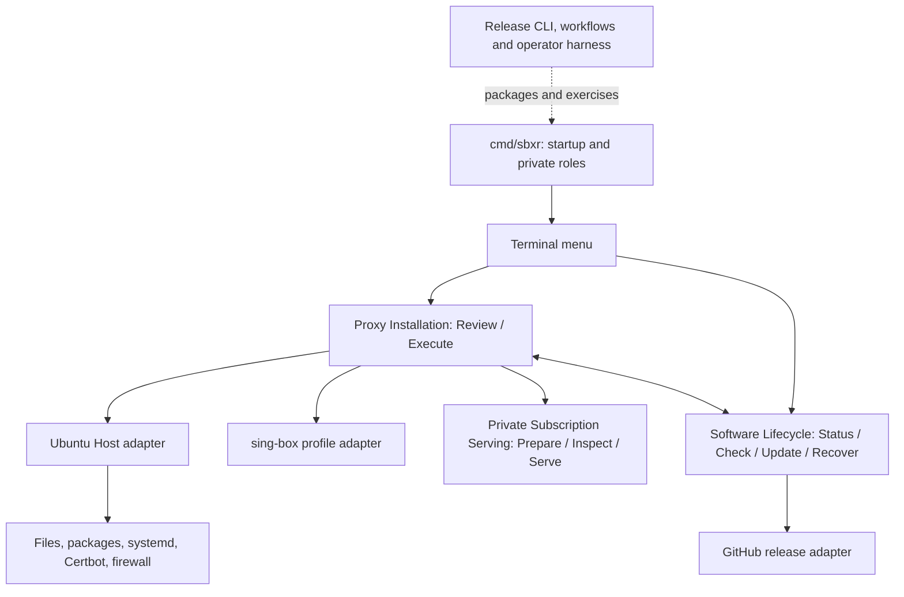

# SBXR modules and first viable product qualification review

This dated review preceded the final MVP policy. References to the V4 producer
below point to its retired source at commit `0859e96`; use ADR-0023 and the MVP
procedure for current policy.

**Recommendation: replace the recurring 25-scenario live marathon with five short product journeys, retain focused ordinary/Linux regression tests, and investigate the already-observed scenario 03 refusal separately. Simplify qualification machinery before changing working product behavior.** This is a review proposal, not an implemented release-policy change or an acceptance pass.

The complete [module/function catalog](2026-09-12-module-function-catalog.md) lists every named Go function and method in the current non-test source, each file's purpose and relevant scenarios, internal types/seams, and the qualification programs. It is intentionally separate from this decision document.

## Scope and evidence

Reviewed the working tree on 2026-09-12, branch `codex/operator-startup-gate-evidence`, HEAD `f83b338`. There were already tracked edits to AGENTS.md, README, navigation/module documentation and Proxy Installation, plus untracked ownership/details extraction and research/acceptance files. Those changes were preserved. This review includes their current contents; it does not treat them as committed release contents.

The controlling simplification principle is [global AGENTS.md](/Users/Albert/.codex/AGENTS.md:1):

> Default to not adding hashes, freezing contracts, creating baselines, or introducing gates.

Its next paragraph requires a concrete failure scenario and an explanation of why Git, versioning, primary keys, transactions, unique constraints, the type system or ordinary tests do not already prevent it. [Repository AGENTS.md](/Users/Albert/Documents/Codex/SBXR/AGENTS.md:27) additionally calls for proportionate changes, tests at the affected boundary, reuse of valid results, and stopping when validation uncovers a separate investigation.

The 25 scenarios are the current **v4 clean-install repair qualification policy**, not a decomposition into 25 product features. [ADR-0022](/Users/Albert/Documents/Codex/SBXR/docs/adr/0022-two-issuance-repair-qualification.md:36) expressly retains 25 live scenarios, 29 automated-only scenarios and two automated-only lifecycle checks. [attemptScenarios](/Users/Albert/Documents/Codex/SBXR/cmd/sbxr-release/qualification_scope.go:132) derives the current selection from a larger historical matrix. Those old requirements were explicitly approved at the time; their existence is not evidence of an unauthorized implementation. The current request is a reason to reassess them.

This was source and document inspection. No production test, candidate build, full test suite, SSH mutation, certificate issuance, Karing operation or release operation was run. Historical/local report results below are attributed to their report; remote publication and VPS state were not refreshed.

## What the code is for

There are **two public product modules**, **one private deep module**, their adapters, and a separate release/qualification toolchain. “Deep” means substantial behavior behind an interface that callers can use without learning the internal sequence. It does not mean many source lines or many safety checks.

The inventory contains **52 non-test Go files and 692 named functions/methods across nine directories/packages**, including release tooling; **41 Go test files**, including five repository-root checks; and **140 Python/shell/workflow files under `.github`**, including harness tests. These are inventory counts, not 692 distinct features or proof of waste.

| Module / smaller module | Main interface or representative functions | What it does | Depth and relevant scenarios |
|---|---|---|---|
| Executable composition: `cmd/sbxr` | `main`, `run` | Root/platform admission, cancellation, menu and fixed recorder/serving/startup role dispatch. | A small composition layer, not another deep product module. 01, 11, 19, 25; shared startup. |
| **Proxy Installation** | `Review`, `Execute` | Decides legal actions, reviews effects, executes setup, changes, cleanup and removal. | A deep owner interface: two operations hide many workflows. Internal coupling is much larger than the owner interface. 01–18, 20–25. |
| Setup / cleanup / removal | `runPreCommit`, `finishSetup`, `cleanup`, `finishRemoval` | Installs proxy resources, activates service, finishes or cleans interrupted work, removes owned resources. | Internal workflow modules. 01–06, 20–23, 25. |
| Ownership and details | `decodeOwnership`, `validOwnership`, `recordResources`, `AdmitSoftwareUpdate`; details functions | Reads ownership and pending operations, identifies removable resources, formats status/corrections. | Ownership is an internal data/decision seam; details is presentation. Used throughout. |
| Subscription enablement | `enableSubscription`, `executeEnablementCleanup` | Creates the HTTPS subscription, token, certificate and integration; cleans interrupted preparation. | Internal workflow. 08; further interruption variants already automated-only. |
| Subscription-link replacement | `rotateSubscriptionLink`, `finishSubscriptionRotation` | Replaces only the URL bearer credential; preserves proxy identity. | Internal workflow. 09–10. |
| Certificate activation and repair | `inspectSubscription`, `executeCertificateActivation`, `repairDiagnosis`, `executeSubscriptionRepair` | Loads an accepted certificate generation and corrects a diagnosed serving/renewal fault. | Internal workflows. 11, 18; other checkpoint variants automated-only. |
| Client Identity replacement | `rotateClientIdentity`, `finishClientIdentityRotation`, `AuthorizeProxyStart`, `finishIdentitySubscription` | Replaces only proxy UUID, terminates old access, coordinates startup and updates the subscription artifact. | Internal workflow spanning runtime and serving. 07, 16–18, 25. |
| Renewal dispatch | `RecordRenewal`, `RecordRenewalHook` | Connects official Certbot invocation/hooks to installed state and diagnostic recording. | Private product entry points, not public commands. 11–15, 20–23. |
| **Private Subscription Serving** | `Prepare`, `Inspect`, `Serve`; `Artifact`, `respond`, `sourceLimiter.allow` | Builds one-node artifact, validates TLS state, authenticates HTTPS retrieval, bounds requests/connections. | Clearest isolated deep module: small interface hides network/TLS mechanics. 08–11, 16–18, 24–25. |
| Host: inspection and mutation | `Preflight`, `Inspect`, `Apply`, `PublishOwnership`, `AcquirePackageLocks` | Implements Ubuntu files, packages, service, firewall and lock operations. | A concrete OS adapter with a broad internal interface. It earns its role by hiding OS details; do not split it just to create more modules. 01–06 and shared mutations. |
| Host: subscription and serving | `PreflightSubscription`, `PrepareSubscription`, `ActivatePreparedSubscription`, `LoadServingCertificate`, `AcquireServingExclusion` | Performs issuance/staging/activation, checks runtime and excludes removal from active serving. | Internal adapter groups. 08–11, 20–25. |
| Host: renewal and contention | `PrepareRenewalRecorder`, `InspectRenewal`, `AcquireRenewalExclusion`, renewal runners/writers | Inspects official schedule, launches child, records outcome and coordinates competing writers/removal. | Substantial complexity inside one adapter file. 11–15, 20–23. |
| Host: startup/identity/update | `WithRuntimeStart`, `BorrowRuntimeStartLock`, `runtimePeerUID`, identity publication/stop/start methods, `CompleteSoftwareUpdateServing` | Shares an already-held lock with a private startup via Unix socket/descriptor; coordinates UUID and software runtime changes. | A real subprocess seam, not a generic process launcher. 07, 16–19; much update behavior lies outside the current 25. |
| sing-box adapter | `PrepareIdentity`, `EncodeServerConfiguration`, `EncodeClientConfiguration`, `ReplaceClientIdentity` | Keys, UUID, server configuration and client connection fields. | Focused transformation adapter. 01, 07–10, 16–18, 25. |
| Terminal adapter | `Run`, menu/lifecycle rendering and confirmation helpers | Presents legal numbered actions and discloses requested links/configuration. | Presentation seam; not an independent business module. All interactive scenarios; 19 directly. |
| **Software Lifecycle** | `Status`, `Check`, `Update`, `Recover` | Installed software identity, latest release, ordering, update transaction and recovery. | Deep owner interface with several private collaboration methods. 01, 06, 19, 25. |
| Lifecycle: local state and lock | `verifyInstalledPair`, filesystem inspection, `AcquireMutationLockAuthority` | Reads installed executable/record and serializes changes. | Internal state/OS mechanisms; shared by proxy. 01, 19, 25 and contention cases. |
| Lifecycle: update transaction/runtime | `prepareUpdate`, `activateCandidate`, `rollbackUpdate`, `cleanupCommitted`, `acquireRuntime`, `completeRuntime` | Replaces executable with rollback before commitment and completion afterward. | Internal transaction seam. **19 proves no-op/refusal, not actual successful upgrade/recovery.** Incoming upgrades are outside this first clean-install scope. |
| GitHub adapter / release support | `CheckLatest`, `PrepareLatest`, asset/index/attestation and acceptance-record checks, `qualifiedReleaseSupport` | Finds and admits downloadable software and supported update sources. | External-service adapter; currently also coupled to detailed qualification policy. 01, 19 and publication. |
| Release CLI | build/index/bootstrap functions; `runQualificationDeclaration`, qualification evaluators | Makes installable assets and decides release preparation, acceptance, publication and failure. | Developer tooling. Its correctness matters to delivery, but its policy objects are not proxy features. |
| Operator harness / collector / transport | numbered scripts, `v3-menu-session.py`, transition/recorder drivers, evidence assemblers | Drives public menu and outside clients, injects failures, coordinates SSH/services, packages observations. | Test machinery. Large parts can shrink when live requirements shrink. 01–25. |

All exact declarations and file links are in the catalog. No correctness claim is made for every individual body. In particular, the private [Subscription Serving README](/Users/Albert/Documents/Codex/SBXR/internal/proxyinstallation/subscriptionserving/README.md:76) still describes an old implementation slice with enablement disabled, whereas current [enablement code](/Users/Albert/Documents/Codex/SBXR/internal/proxyinstallation/subscription.go:67) and the root module guide describe implemented enablement. Treat that section as stale incremental documentation, not a missing-feature requirement.

## Disposition of all 25 live scenarios

**Live** means a compact observation of behavior across an actual external boundary. **Ordinary/Linux integration** means retain meaningful regression coverage using real files/processes/locks/systemd where needed, without tying it to a new release attempt. Existing mocks do not automatically satisfy that move. **Conditional** means run when the relevant dependency or execution path changes. None of these recommendations silently removes a shipped feature.

Scenario names and purposes are cross-checked against the [operator scenario map](https://github.com/albertloky/SBXR/blob/0859e964b66d10deb5768a372b09ca5903332553/.github/scripts/v3-operator/README.md#L191), [scenario checks](/Users/Albert/Documents/Codex/SBXR/cmd/sbxr-release/qualification_recurring.go:400) and [detailed procedures](/Users/Albert/Documents/Codex/SBXR/docs/acceptance/v4-operator-procedures.md:163).

| # | Exact scenario | Owning code | Recommendation and reason |
|---:|---|---|---|
| 01 | `baseline-clean` | Bootstrap, lifecycle, setup, Host, sing-box | **Keep live, combine menu checks.** Installation, working outside proxy traffic and normal removal are core outcomes. Do not require repeated teardown/setup merely to establish later origins. |
| 02 | `baseline-refusal` | Setup preflight, ownership, Host | **Ordinary/Linux integration.** Refusing to overwrite a foreign file is worthwhile; a real filesystem fixture can prove it without a candidate or outside network. |
| 03 | `baseline-precommit` | Setup, prepared review, cleanup; interruption driver | **Focused unresolved investigation now; ordinary/Linux integration afterward.** Interrupted setup must leave a usable cleanup path. Current observed refusal cannot be dismissed as paperwork. Reproduce its actual boundary, then use one targeted packaged confirmation if needed, not all 25 cases. |
| 04 | `baseline-postcommit` | Setup commitment and `finishSetup` | **Ordinary/Linux integration.** Recovery must finish the selected setup. Distinct from 03, but no need to repeatedly re-prove every checkpoint on a public VPS. |
| 05 | `baseline-drift` | Ownership/removal inspection | **Ordinary filesystem tests.** Detect modified/foreign resources before deleting them. Preserve ownership behavior; deliberate mode/metadata corruption adds little recurring live value. |
| 06 | `baseline-removal` | Removal checkpoints, Host, lifecycle | **Ordinary/Linux interruption test.** Normal removal stays in the live journey; forced interruption and finishing are deterministic recovery cases. |
| 07 | `identity-absent` | UUID rotation, startup, no-subscription branch | **Move the absence/schema-origin variant to integration; merge normal rotation into one live credential journey.** A separate complete install/rotate/remove cycle is unnecessary for each release. |
| 08 | `enable-schema1` | Enablement, Certbot, artifact, serving | **Keep a reduced live enablement journey.** Prove trusted external HTTPS and correct client import. Schema conversion/provenance details belong primarily in ordinary tests. |
| 09 | `link-precommit` | Link rotation rollback and runtime | **Ordinary/Linux integration for interruption.** Keep one normal link rotation/revocation in the shared live credential journey; no repeated controlled precommit hold. |
| 10 | `link-postcommit` | Link rotation forward completion | **Ordinary/Linux integration for interruption.** Prove target-only finishing locally; the normal live rotation checks old URL rejection and new URL retrieval. |
| 11 | `managed-renewal` | Recorder/hooks, repair, activation, serving | **Keep one simplified live official-route/certificate activation check.** HTTPS must continue after certificate replacement. Forced child holds, failure receipts and repair choreography move to integration. Initial issuance alone is not renewal proof; do not invent extra production requests merely to create failures. |
| 12 | `recorder-live` | Renewal child identity and receipt status | **Ordinary/Linux service integration.** Running versus abandoned child/receipt classification needs actual process behavior, not public CA or Karing interaction. |
| 13 | `recorder-locks` | Host/renewal/writer lock ordering | **Ordinary Linux concurrency regression.** Real lock/process coordination can detect deadlock and bounded refusal without a full qualification attempt. |
| 14 | `snap-refresh` | Host Certbot route/hooks and package integration | **Conditional supported-package compatibility check.** Exercise real snap/systemd refresh when package versions or route integration change. It need not be a forced package upgrade during every product release. Retain a current official-route smoke check in renewal. |
| 15 | `unsupported-route` | Renewal route inspection/diagnostics | **Ordinary fixture tests; defer expanded route-accounting features.** Detecting renamed/extra routes and explaining unknown history is useful diagnostics, but the procedure expressly does not prove prevention. Do not build more machinery to make this scenario stronger. |
| 16 | `identity-precommit` | UUID rollback/startup exclusion | **Ordinary/Linux recovery test.** Source-only restoration before revocation is a real rule; controlled process holds do not have to repeat live. |
| 17 | `identity-postcommit` | UUID forward completion/startup | **Ordinary/Linux recovery test plus normal live revocation.** After committed replacement, old credentials must fail. Live-check that result once without a separate interrupted journey. |
| 18 | `identity-unavailable` | Identity/subscription collaboration, repair and fallback | **Move the composite outage/interruption/fallback matrix to integration.** A working proxy should remain independent of a failed subscription endpoint. Use a targeted live outage observation only when that interaction changes or reproduces a reported issue. |
| 19 | `lifecycle-menu` | Terminal, Software Lifecycle, GitHub | **Merge into install/menu smoke.** Check reachable actions, real latest lookup, no supported update/no recovery. Already excludes two automated-only checks. It does not justify building an incoming upgrade for this clean-install product. |
| 20 | `remove-certbot` | Removal and renewal exclusion | **Ordinary/Linux service integration.** A real active Certbot child should not race deletion; same service/child behavior can be tested on disposable Ubuntu independently of release qualification. |
| 21 | `remove-writer` | Renewal outcome writer and removal | **Ordinary/Linux concurrency regression.** An active writer must not recreate state during removal. Test the actual writer/lock, not a fake PID or a fabricated file. |
| 22 | `remove-admission-race` | Prepared removal, renewal admission lock | **Ordinary/Linux concurrency regression.** This is a genuine check-then-act race between two processes. Keep the regression, remove its mandatory live ceremony. |
| 23 | `remove-directory-lock` | Certbot POSIX directory locks | **Ordinary real-lock integration.** Verify correct lock family and bounded contention; neither Internet access nor a signed candidate adds relevant proof. |
| 24 | `secret-containment` | Serving sandbox/permissions plus capture scanner | **Split.** Keep normal product secret permissions, authentication, sandbox and output checks; spot-check installed files/unit/log behavior during live setup. Drop the standalone six-surface capture-inventory/metadata/process-proof exercise from MVP product acceptance. Clean up actual test artifacts as ordinary test hygiene. |
| 25 | `karing-final` | Artifact, serving, identity, client integration, removal | **Keep a shorter client journey.** Actual link import, one correct node, fresh node latency, manual refresh and normal cleanup. If rotation is retained, verify refreshed credentials in the same session. Move forced outage and recovery variants out; do not require an exact five-minute due-refresh wait on every candidate. Run client auto-refresh once on initial supported-client integration or when relevant integration changes. |

The two-sided interruption cases are not logically identical; the recommendation changes their **test level and recurrence**, not their expected behavior. The removal-contention cases also protect different lock windows. Keeping their Linux regressions is reasonable even though running all four on every live release is unnecessary.

## Five compact live journeys for the current product

This assumes the already-implemented subscription and credential-management features remain available. It does not silently redefine the product as proxy-only. These are acceptance outcomes to combine into a practical session, not a request to build five new frameworks or mandatory scenario scripts.

1. **Install, set up and use it.** Run the packaged install/menu on supported Ubuntu, review/setup, see useful status/details, exercise Check and safe no-update/no-recovery, and send real traffic through an independent outside client. Check that the SSH connection still works. Covers core 01 and 19.
2. **Get a usable subscription into Karing.** Enable HTTPS with real trusted TLS, retrieve the one-node artifact, import it and obtain a fresh node latency result, then refresh the same link. Check wrong-token rejection, installed secret permissions and ordinary output/log exposure along the way. Preserve the Owner's selected server/settings. Covers core 08, product portion of 24 and client portion of 25. Per-node latency does not establish Karing browsing; outside traffic is proved separately in journey 1.
3. **Change credentials once.** Rotate the proxy UUID: old credentials fail, a previously established outside session ends if that remains the advertised revocation contract, the link stays stable and refreshed/new access works. Separately rotate the subscription URL credential: old URL fails, new URL works and proxy identity remains unchanged. No induced interruptions. Extracts normal outcomes from 07, 09–10, 16–18 and 25.
4. **Keep HTTPS working after certificate replacement.** Exercise the actual supported Certbot/activation route and observe the replacement through outside TLS. Check the official schedule is configured. Initial issuance is not sufficient, and a manually exercised route is not evidence that the natural timer fired. Keep a bounded, honest observation instead of waiting days or forcing repeated failures. Covers the product purpose of 11; package refresh is conditional.
5. **Restart and remove it.** Check an ordinary service restart preserves usable configuration/credentials, then perform normal Complete removal and confirm owned services/listeners/resources are gone and unrelated resources remain. Check old outside access fails. Reuse this as final client cleanup; do not repeatedly reinstall solely for evidence origin. Normal restart is a small operational observation included in this proposal, not a claim that an existing numbered case explicitly covers it.

Scenario 03's known refusal remains a separate targeted question. Resolving it does not require rebuilding the 25-case sequence. If a smaller launch omits credential rotation entirely, journey 3 and the corresponding UI/features can be explicitly deferred; that is a product-scope choice, not permission to advertise those functions while discarding their correctness expectations.

## Which safety mechanisms earn their place

| Mechanism / burden | Concrete failure | Do existing ordinary controls suffice? | Recommendation |
|---|---|---|---|
| Ownership record and bounded deletion | Removing someone else's configuration, Certbot lineage or firewall rule | Git has no authority over a live host's files. An ownership record, careful path handling and ordinary removal tests directly address it. | Keep practical ownership checks. Do not add an independent shadow inventory or forensic baseline. |
| Mutation/Certbot/writer exclusion | Renewal writes files while removal deletes them; two mutations conflict | The type system cannot serialize independent processes. Existing locks and transactions can; real Linux tests can prove the changed path. | Keep the locks needed for actual races. Do not add more lock layers or repeat live contention for unchanged code. |
| Interrupted operation recovery | SSH/process death leaves half-installed resources | Git does not undo filesystem, package or service effects. Existing checkpoints and idempotent finishing/cleanup address this. | Keep a workable recovery path and focused failure tests. Avoid demanding live proof of every checkpoint. |
| Artifact authentication and download integrity | Wrong or corrupted bytes execute as root | A source commit alone does not authenticate a downloaded binary. Existing package signing/attestation and one artifact digest serve a real purpose. | Retain necessary trust checks. A new evidence hash for every observation is a different mechanism. |
| TLS, credential permissions and no secret logs | An unauthorised client gets the proxy secret; logs expose bearer URLs/private keys | TLS/crypto libraries, OS permissions and focused tests address the concrete exposure. Git does not protect runtime logs. | Keep normal authentication/permissions and relevant sandbox checks; trim qualification-wide forensic coverage. |
| Every observation hashes itself and the previous scenario | Accidentally mixing, reordering or editing results | Run/scenario identity, normal ordered validation and retained workflow artifacts usually suffice for operational review. A self-hash is not independent authentication; exact artifact identity still matters. | Remove the extra evidence digest chain as a recurring product requirement. Retain understandable result attribution. |
| Exact helper/test/README/log hashes and a 24-hour rehearsal expiry | Running stale harness code or mismatched fixture results | Git/workflow identity identifies tracked source; affected-path tests and deliberate bundle transport verification handle actual changed/deployed code. Git alone does not verify remote transfer. Unchanged evidence does not become wrong merely at 24 hours. | Reuse relevant unchanged test results; retest affected code/dependencies. Drop arbitrary freshness and documentation-byte invalidation. |
| Whole suite failure burns candidate and all progress, including evidence refusal | A failed candidate is accidentally published as fully tested | Normal CI failure status and release/version identity distinguish failed attempts; changed product bytes need fresh affected validation. They do not require pretending prior failures passed. | Do not consume a new product version solely for a test-driver/report problem. Preserve failed attempts; retry affected tests against clearly identified unchanged bytes when the reason is understood. This requires a coordinated policy/tooling change. |
| Original SSH session identity as repeated evidence | Firewall/setup cuts off administration | Real SSH continuity/reconnect and relevant firewall tests address lockout. One uninterrupted control-session identity is additional harness semantics, not the only way to prove reachability. | Preserve access during actual operations; remove continuous same-session proof as a product-wide acceptance requirement. |
| Exact Karing package digest and repeated five-minute timing | Client incompatibility or auto-refresh failing | Record the actual supported/tested client version; real import/refresh plus a one-time/changed-integration scheduler observation addresses it. Source tests cannot prove arbitrary client versions. | Narrow the compatibility claim honestly. Stop invalidating every unrelated SBXR candidate for unchanged client timing evidence. |

This is not a recommendation to erase all hashes or guards. The global rule asks for purpose and proportionality. It also does not imply existing valid negative tests should be deleted simply because they are numerous.

## Standards review

Five findings from the independent Standards review, with the main review's evidence qualifications retained:

1. **The fixed count is historical policy, not module coverage.** ADR-0022 and `attemptScenarios` preserve/derive the current list. Creating a module-to-test map should not create another completeness gate. The original policy was approved; revisiting it now is appropriate.
2. **The rehearsal prerequisite is broader than product proof.** [Operator README](https://github.com/albertloky/SBXR/blob/0859e964b66d10deb5768a372b09ca5903332553/.github/scripts/v3-operator/README.md#L61) invalidates a report after 24 hours or helper/document changes. Retest relevant executable mechanisms when changed; arbitrary age and documentation hashes do not establish more working-product behavior.
3. **Evidence bookkeeping is repeatedly enforced.** [requiredV3Checks](/Users/Albert/Documents/Codex/SBXR/cmd/sbxr-release/qualification_recurring.go:367) repeats common checks and [validRecurringEvidence](/Users/Albert/Documents/Codex/SBXR/cmd/sbxr-release/qualification_recurring.go:225) enforces timing, ordering and digest links. Recheck mutable product state when an action can change it; consolidate attempt-wide facts and remove redundant digest ceremony. Do not infer that checking an invariant once covers later mutations.
4. **Recurring live tests exceed the necessary external boundaries.** Recorder/removal locks, menu refusals and controlled route drift can be tested through ordinary Ubuntu integration. A real snap update is dependency compatibility and deserves a conditional run, not a mandatory upgrade in every live session.
5. **Possible duplicated-code maintenance in test fixtures.** [recurringEvidenceFixture](/Users/Albert/Documents/Codex/SBXR/cmd/sbxr-release/qualification_recurring_test.go:230) repeats much of the scenario state/check construction. This is a maintenance judgment, not proof the tests are invalid: independent expected fixtures can be valuable. When the policy shrinks, simplify affected fixture construction and keep focused missing/wrong-result tests. Do not make expected results call the production evaluator, which would make the test tautological.

Standards result: **5 simplification findings**; the strongest burden is the recurring rehearsal/evidence prerequisite, rather than a demonstrated need for more product safety code.

## Spec review

The independent Spec review found a narrower possible MVP that could defer rotations. This integrated recommendation retains already-implemented rotations by default and reduces their live variants; deferral remains explicit rather than assumed.

1. **Qualification protocol is larger than customer behavior.** Exact chained results, evidence count/order, short submission clocks and package identity repetition establish compliance with an evidence protocol. They are implemented as required by the old policy, but the current request calls their necessity into question. This is a proposed scope reduction, not a claim that the historical implementation was unauthorized.
2. **The current documentation does not separate launch necessities from later management depth.** Setup, subscriptions, rotation, renewal, recovery and qualification appear together. The five journeys above state the proposed launch outcomes; incoming upgrades and expanded route accounting can wait.
3. **The first clean-install scope does not require proving a nonexistent incoming upgrade.** [Software Lifecycle's guide](/Users/Albert/Documents/Codex/SBXR/internal/softwarelifecycle/README.md:62) and [scenario 19](/Users/Albert/Documents/Codex/SBXR/docs/acceptance/v4-operator-procedures.md:993) distinguish future updates from current no-op/refusal behavior. Do not add an update route merely to satisfy a historical larger matrix.
4. **The current failure does not establish its cause.** A public cleanup action refused in scenario 03. It may be an important product defect or a harness/state interaction; the report does not resolve that. Neither a product repair nor dismissing the failure is justified yet. A focused reproduction is the next technical action if this behavior is pursued.

Spec result: **4 scope/uncertainty findings**; the principal gap is a clear launch acceptance scope, with one unresolved cleanup failure. This review does not rank that uncertainty as a confirmed product defect.

## Existing tests worth reusing

The repository already has relevant ordinary tests; this review inspected their presence and selected bodies, not their current results:

- [Setup/cleanup/restart cases](/Users/Albert/Documents/Codex/SBXR/internal/proxyinstallation/proxyinstallation_test.go:1939), including precommit cleanup, committed setup finishing and every durable checkpoint.
- [Link-rotation recovery](/Users/Albert/Documents/Codex/SBXR/internal/proxyinstallation/proxyinstallation_test.go:1379) and [enabled identity recovery](/Users/Albert/Documents/Codex/SBXR/internal/proxyinstallation/client_identity_subscription_test.go:114).
- [Actual Certbot POSIX lock fixture](/Users/Albert/Documents/Codex/SBXR/internal/proxyinstallation/adapter/host/subscription_test.go:42), [recorder publication tests](/Users/Albert/Documents/Codex/SBXR/internal/proxyinstallation/adapter/host/renewal_test.go:433), and [renewal exclusion tests](/Users/Albert/Documents/Codex/SBXR/internal/proxyinstallation/adapter/host/renewal_test.go:807).
- [Private dispatch/TLS composition](/Users/Albert/Documents/Codex/SBXR/internal/proxyinstallation/serving_test.go:100), network tests beside `subscriptionserving/serving.go`, and Linux-specific sandbox tests.
- Menu tests, update transaction/runtime tests and release adapter tests in their owning packages, plus operator tests for real menu I/O/process cleanup.

Many product tests inject adapters; some operator tests model the OS and have separate kernel fixtures. A move from live to integration requires checking that the relevant syscall/process/service is genuinely exercised, not adding a mock that bypasses it. Reuse tests that already do this. Add or repair a regression only for a demonstrated uncovered failure or an actual behavior change.

## Stop the fix/test/fix cycle without hiding a failure

The local [v3.1.69 report](/Users/Albert/Documents/Codex/SBXR/docs/acceptance/v3.1.69-live-2026-09-12.md:10) records **2 accepted, 1 failed, 22 blocked**. It records 307 helper tests and a 136-file bundle, followed by a `Prepared Action facts` refusal after an observed setup interruption; later supported cleanup completed. Those counts show that preparation did not predict this failure, not that every preparatory check was useless.

The public code has several possible refusal sites: [Finish cleanup's staged checkpoint recovery](/Users/Albert/Documents/Codex/SBXR/internal/proxyinstallation/proxyinstallation.go:986) and [fresh authority/inspection comparison](/Users/Albert/Documents/Codex/SBXR/internal/proxyinstallation/proxyinstallation.go:1023) both produce that message. The report alone does not identify the changed fact. Do not remove `reflect.DeepEqual` or weaken ownership checks solely to obtain a green scenario.

Use the retained case to distinguish (a) a wrong product result, (b) a driver that does not reproduce a real owner action, and (c) an unnecessary observation-format requirement. Only (a) justifies changing product behavior; (b) belongs in the driver; (c) belongs in the acceptance policy. Then run the affected regression and relevant integration once. A separate discovered problem becomes a separate decision, as the repository instructions already require.

## What adopting the proposal would change

First reduce the acceptance requirement and its documentation. Then make the smallest matching release-tooling change. Do not start by altering product behavior to satisfy the current 25 scenarios, and do not simply delete scenario IDs from a script: installed [GitHub release-support parsing](/Users/Albert/Documents/Codex/SBXR/internal/softwarelifecycle/adapter/github/release_support.go:13) also interprets policy, disclosures and accepted evidence. The producer, validator and reader must agree on the smaller declared scope while historical records retain their meaning through ordinary versioning.

The relevant edit surfaces are `qualification_scope.go`, `qualification_recurring.go`, declaration/workflow callers, the GitHub acceptance reader, and the current operator documentation/tests. That is a concrete dependency list for a later bounded change, not authorization to rewrite all those modules now. Preserve normal artifact verification and failed-run records. Do not introduce another signed matrix, immutable contract, hash catalog, baseline, or preflight framework to govern this simplification.

Product deletion/refactoring can wait. Optional candidates for later scope reduction are the bespoke renewal diagnostic recorder/route-accounting depth, exhaustive transition-recovery permutations, and future incoming-upgrade support. The recorder is currently connected to renewal launch, hooks, status, repair and removal locks, so deleting `renewal.go` is not an isolated cleanup. Its diagnostic-only description does not make its runtime effects optional. Separate that potential feature redesign from reducing qualification today.

**Delivered:** a complete declaration/navigation catalog and a disposition for each of the 25 scenarios. **Changed:** only these two new review documents. **Not implemented:** test deletion, qualification-policy changes, product fixes or releases. **Not validated this turn:** product behavior, Linux test outcomes, current VPS state or Karing acceptance. The known scenario 03 cause remains unresolved.
